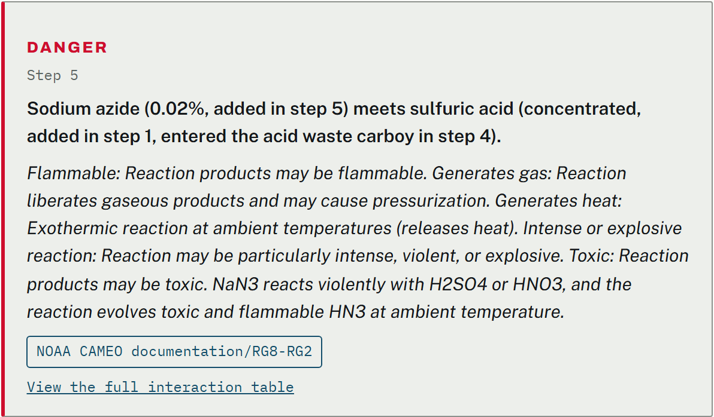
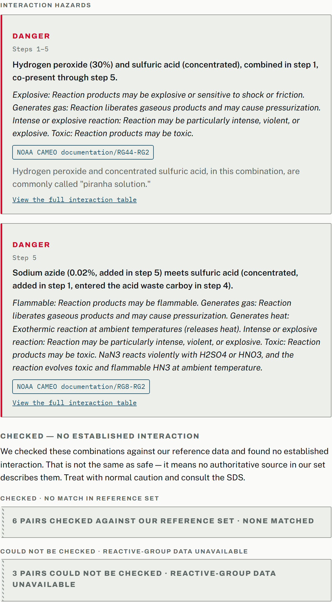
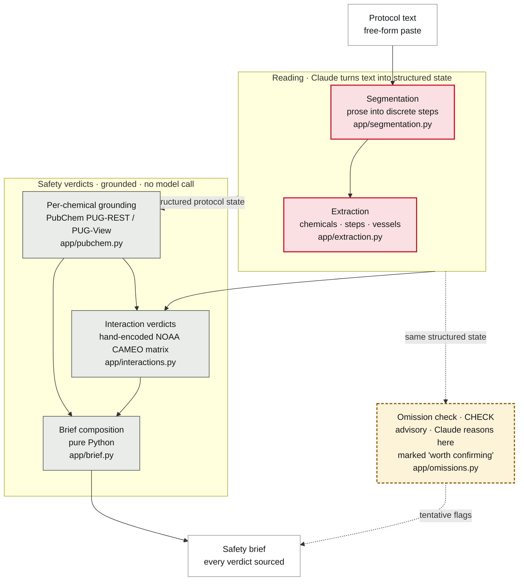

# preCaution

**Paste a written lab protocol. Get back a short, sourced, procedure-specific safety brief.**

Not another 16-section SDS to read. preCaution reads the steps you actually plan to run and tells you what is dangerous about *this* procedure, with every hazard traced to a public database.

> Claude read the protocol. Claude did not write the safety advice.




*Sodium azide meets sulfuric acid three steps and one shared waste carboy later. Caught, cited, and traced to NOAA CAMEO. No inventory screener sees this, because the two chemicals are never named in the same sentence.*

Built for the **Built with Claude: Life Sciences Hackathon** (Builder Track, "Build Beyond the Bench"), in partnership with the Gladstone Institutes. [MIT licensed](LICENSE).

---

## Highlights

- **Catches cross-step hazards, not just same-sentence mixing.** preCaution tracks each chemical across the whole procedure (`added` / `carried_over` / `residual`), so it flags a reagent meeting another one several steps and a vessel-transfer later, which single-sentence scanners miss entirely.
- **Reads free-text protocols, not just clean numbered lists.** Paste a paragraph of bench notes. It segments the prose into steps first, then reads it. The messy protocol is exactly the one a newcomer never reasoned through, so it is the one that matters most.
- **Every hazard verdict is grounded, not generated.** Interaction verdicts come from a hand-encoded NOAA CAMEO table. Per-chemical hazards come from PubChem. No safety verdict is written by a model.
- **"No data" never means "safe."** A chemical with no hazard record and a chemical checked and found benign look different in the brief, cite different sources, and are never conflated.
- **It says what the protocol left unsaid.** An advisory layer flags controls a step never mentions but the chemical's own safety data calls for, marked tentative and sourced to that chemical's record.
- **Every claim carries a source, enforced by a test.** The build fails if any statement in the brief is missing a source reference.

---

## What it is, and is not

preCaution is a **defensive safety-checking tool**. It reads a procedure a scientist already plans to run and warns them about it. It does not design experiments, suggest syntheses, or help make anything, and it does not replace institutional EHS sign-off. It prepares a scientist to work safely and to have a better-informed conversation with their safety officer.

**Who it is for:** rotation students, new grad students, and new postdocs, constantly handed protocols they did not write, using chemicals they have never personally handled.

## The problem

The safety information a newcomer needs already exists, but it is buried in 16-section Safety Data Sheets and 100-plus-page institutional manuals that nobody has time to map onto their specific procedure. Under time pressure, people guess or skip the check. The American Chemical Society names poor planning and risk assessment of new experiments as a top cause of academic lab incidents.

## What it catches

The repo ships with a locked demo protocol, a piranha-solution cleaning procedure, five steps and six chemicals, small enough to read in ten seconds and still producing two real, differently-shaped hazards, plus the advisory layer in action.

1. **Step 1, direct mixing.** Concentrated hydrogen peroxide added to concentrated sulfuric acid, same sentence, same vessel. Flagged `DANGER`: CAMEO's own reactive-group prediction for a strong oxidizer meeting a strong oxidizing acid, with the plain-language note that this is commonly called piranha solution.
2. **Step 5, the carryover catch.** The protocol never puts sodium azide and sulfuric acid in the same sentence. Step 1 puts sulfuric acid in a beaker, step 4 pours the spent solution into the acid-waste carboy, step 5 rinses a sodium-azide buffer into that *same* carboy. preCaution tracks each chemical across steps rather than scanning single sentences, so it catches the azide meeting the acid three steps later, and cites CAMEO's documented example: sodium azide plus sulfuric acid evolves toxic, flammable hydrazoic acid gas.
3. **The advisory layer.** On top of the grounded verdicts, preCaution flags gaps: where a chemical's own safety data calls for a control the step does not mention (ventilation for methanol during fixation, a disposal route for a residual). These are marked `CHECK`, worded as "worth confirming," and are the one place the tool suggests rather than looks up. See [How the trust works](#how-the-trust-works).



## How it works

Six stages, one protocol in, one brief out. Claude appears in three of them, all on the reading side. Every safety verdict is produced downstream by grounding and composition, not by a model.



Claude reads and structures the protocol (segmentation and extraction) and reasons in one advisory layer (the CHECK omission flags). It does not write a single hazard verdict. The interaction cards and the per-chemical GHS data are looked up from real databases and do not depend on the model being right about chemistry. That is the claim the whole tool rests on, and it survives a rerun.

## How the trust works

Hallucinated hazard data is the top reason scientists abandon AI safety tools, so nothing here is left to a model's memory. The dividing line is not how many times Claude is called. It is where each claim comes from.

| What the brief claims | Where it comes from | Who decides it |
| --- | --- | --- |
| Per-chemical hazards (GHS, PPE, first aid, disposal, storage) | PubChem (PUG-REST, PUG-View), linked per record | Database. Claude only resolves the name to look up. |
| Pairwise interaction verdict | Hand-encoded NOAA CAMEO matrix, fetched and quoted at build time | Lookup table. No model call. |
| Which chemicals meet, in which step | Claude's read of the protocol, marked `unverified` in the brief | Claude. Disclosed, not blended in. |
| Omission flags (`CHECK`) | Each chemical's own PubChem safety data, surfaced by Claude, marked "worth confirming" | Claude reasons; the data it points at is sourced. Advisory only. |

The first two rows are grounded and do not vary. The last two are Claude's reading, and are labeled as such wherever they appear. In particular, the `CHECK` layer is the one place the model reasons rather than looks up, so its flags are prompts to confirm, not settled findings, and their exact wording and coverage can vary between runs. That is by design, not a defect: it is why they wear the tentative marker instead of being dressed up as verdicts.

**"No data" is not "safe," and the tool shows the difference.** Water and phosphate-buffered saline both show no signal word and no pictogram, so at a glance they look identical. They are not the same absence. Water carries a real GHS record sourced to the European Chemicals Agency, "Not Classified," a positive, checkable finding of non-hazard from a named regulatory body. PBS has no GHS record in PubChem at all, never checked. The brief cites these differently and expands them into different content. Water is classified and benign; PBS is unclassified. The tool knows the difference and shows its work for both.

**The final brief is pure composition, zero Claude calls.** `build_brief()` copies already-fetched fields into rendered statements. It does not select, rank, or write. With no generation step in the render path, there is no mechanism by which an ungrounded claim could enter the brief.

<details>
<summary><b>Bugs found while building it</b></summary>

Two of these are trust-architecture failures: the citation was real and the data was genuinely sourced, but the composition around it was still wrong.

1. **The failure state that could never fire.** `ground_chemical()` originally let a PubChem outage crash the whole run. That meant the "incomplete brief" banner, whose entire purpose is to stop a partial brief from looking complete, was unreachable in practice: the one state that most needed to survive a failure was destroyed by that failure. Found by building the failure state, not by code review. Fixed by isolating a grounding failure to the single chemical instead of the run.
2. **The GHS multi-notifier merge.** PubChem holds independent GHS submissions from multiple notifiers per compound. Pulling statements from all of them produced a merged, internally-contradictory hazard list credited to "PubChem" as if it were one source. Fixed by matching PubChem's own display behavior and citing the primary notifier by name.
3. **The caption that lied on every protocol but one.** The left-panel caption was hardcoded to the demo protocol's name and printed it on every input. It survived roughly 70 automated test runs, because the test fixture *is* the demo protocol, so a hardcoded value and a correct one are byte-for-byte identical whenever the input is the demo. The bug was only visible on a non-demo protocol, and nothing asserted the caption against one. The lesson outlived the fix: any value hardcoded to the demo is invisible to demo-based tests, so every user-visible field now needs at least one assertion against a non-demo fixture.
4. **Mojibake.** Some of PubChem's own response bytes were double-UTF-8-encoded at the source, confirmed by inspecting raw bytes, and rendered as garbled characters. Root-caused and reversed deterministically.

</details>

<details>
<summary><b>Known limitations</b></summary>

These are properties of the method, the honest bill for what "looked up, not generated" does and does not cover.

1. **Which pairs get checked is not grounded, the largest limitation.** Every verdict is a real lookup, but the *set of pairs* looked up comes from Claude reading the protocol. A pair Claude never constructs is never evaluated, and nothing downstream would notice. Marked `unverified` in the brief.
2. **The advisory `CHECK` layer is not deterministic.** It is a model reasoning about gaps, so its flags can vary in wording and coverage across identical reruns. It is intentionally the tentative tier and prefers a missed flag to a false one. It is never presented as a verdict.
3. **Concentration is shown but never changes a verdict.** The azide-plus-acid hazard flags identically whether the carboy holds a trace or solid.
4. **Order of addition is not modeled.** Reverse the demo's peroxide-into-acid to the dangerous order and the brief is unchanged.
5. **No model of consumption.** Spent piranha is treated as holding its original reagents. Errs toward over-warning, the right direction for a safety tool.
6. **The matrix flags a dangerous reaction class, not this specific reaction.** Temperature is not modeled.
7. **The matrix is pairwise.** NOAA's own docs note pairwise prediction cannot anticipate three-substance interactions, and step 5's carboy has three.
8. **It only knows what this protocol puts in a vessel,** not what a shared waste container already held.
9. **The interaction matrix is a seed set, currently four entries.** Three cover the demo's reactive-group pairs; a fourth (basic salts meeting strong oxidizing acids, e.g. bleach and sulfuric acid) was hand-authored from CAMEO's documentation. Paste a different protocol and most pairs return `no_established_data`, surfaced honestly, never implied safe.

</details>

<details>
<summary><b>Roadmap: designed, deliberately not built</b></summary>

- **Agentic build-time matrix extender.** An agent that fetches a new CAMEO datasheet and proposes a matrix entry with its source quote attached, to a human for review before it is added. Keeps the "fetched and quoted, not recalled" rule intact while the matrix grows past its seed set.
- **Byproduct grounding.** A reaction byproduct (hydrazoic acid) has its own CID and could be grounded the same way its precursors are.
- **Glove-material recommendations, rejected on the merits.** Breakthrough data lives with manufacturers, not in any free structured database, and OSHA warns published times can be optimistic. Showing where the data stops is more honest than guessing a material.
- **Reagent substitution, also rejected on the merits.** Substitution requires knowing what the reagent is *for*, and a newcomer, this tool's user, cannot safely judge whether a swap preserves the experiment. Suggesting one would be a new risk the tool created.

</details>

<details>
<summary><b>What I learned building this</b></summary>

- The restraint was the product. Every instinct during a hackathon is to add flags and features. The value here came from the opposite: the tool is trusted because most of it refuses to let a model write the answer, and the one advisory layer is honest about being advisory.
- The most valuable input is the messy one. The tool that only reads clean numbered protocols is close to no tool, because a scientist who wrote a clean protocol already reasoned through it. Getting it to read free-text prose is what makes it real.
- A test fixture can hide a bug from itself. A value hardcoded to the demo passed 70 runs because the demo is the fixture. The fix was one line; the lesson was to assert every visible field against something that is not the demo.

</details>

## Running it

**One command.** It creates the virtual environment, installs dependencies, and launches the app:

```bash
bash run.sh      # macOS / Linux
```
```powershell
.\run.ps1        # Windows (PowerShell)
```
If PowerShell blocks the script (`running scripts is disabled on this system`), run it once as
`powershell -ExecutionPolicy Bypass -File run.ps1`.

On first run the script copies `.env.example` to `.env`. Add your `ANTHROPIC_API_KEY` (from [console.anthropic.com](https://console.anthropic.com/)) to that file: the app starts without one, but reading a protocol needs it. The scripts are safe to re-run and skip any setup step already done.

<details>
<summary>Prefer to set it up by hand?</summary>

```bash
python -m venv .venv
.venv/bin/activate            # macOS/Linux; use .venv/Scripts/activate on Windows
pip install -r requirements.txt
cp .env.example .env          # add ANTHROPIC_API_KEY
uvicorn app.main:app --reload
```
</details>

Open `http://127.0.0.1:8000`, paste a protocol or load the built-in demo, and click **Read the protocol**. The UI streams the pipeline over Server-Sent Events (`POST /brief/stream`) with a live stage log. Direct endpoints: `POST /extract` (reading only), `POST /brief` (full pipeline, one response), `GET /interaction-matrix` (the in-app table), `GET /health` (liveness).

**Timing**, on the locked demo: **~58s cold, ~32s warm** (measured). Every run makes two live Claude reasoning passes, reading the protocol into structured state and running the `CHECK` omission pass, so it is never instant, and that is the point: it is doing real reading, not returning a canned answer. Cold adds a fresh PubChem grounding pass across six chemicals; warm reuses disk-cached grounding, leaving just the two live calls. Real single-run numbers, expect variance from Claude and PubChem latency.

## Testing

[](https://github.com/theyuvrajgupta/PreCaution/actions/workflows/tests.yml) 

```bash
pytest                    # excludes tests marked `costly` (real API spend)
pytest -m costly          # opt into the costly (real API) tests
```

The suite is **75 passing**, plus 7 `costly` tests deselected by default (they spend real API budget). The test that makes "every claim is sourced" real rather than a slogan is `test_every_brief_statement_has_resolvable_source_ref`: it fails the build if any statement in the brief lacks a source reference, and grounded statements must also carry a source URL.

## Status

Active build, Built with Claude: Life Sciences Hackathon, July 2026.

## Acknowledgments

Built with [Claude Code](https://claude.com/claude-code): architecture, implementation, and testing across all pipeline stages and the web UI were developed in an interactive session with Claude. That collaboration is the subject of the hackathon. It does not change the tool's own rule that every hazard verdict traces to PubChem or CAMEO, never to model recall.

## License

[MIT](LICENSE). Chemical hazard data comes from two public sources, credited inline throughout the brief: [PubChem](https://pubchem.ncbi.nlm.nih.gov/) (NIH/NLM, public domain) and [CAMEO Chemicals](https://cameochemicals.noaa.gov/) (a joint NOAA/EPA tool). Neither organization endorses this project.
