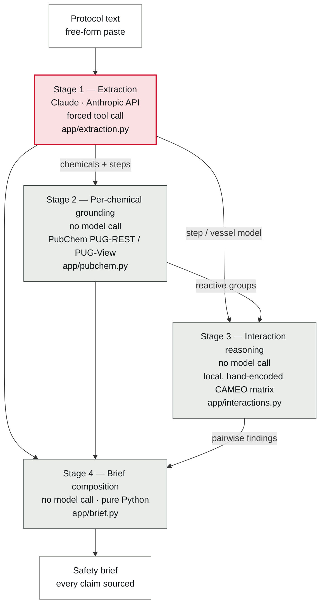
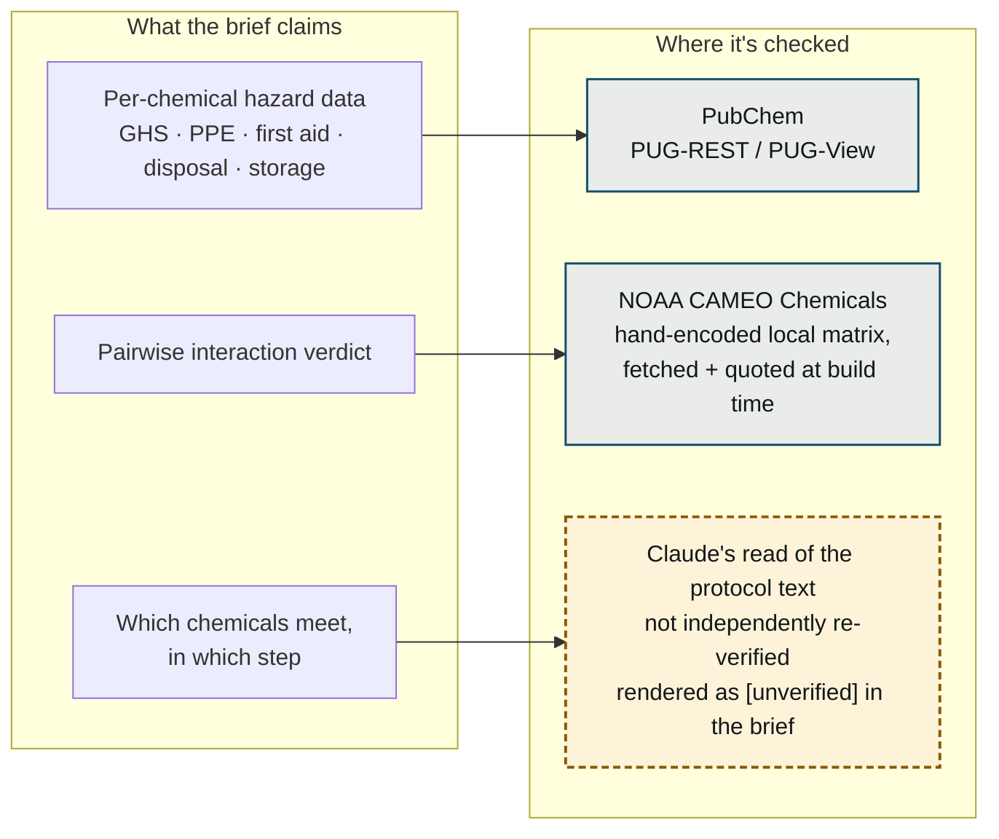

# PreCaution

**Procedure-aware lab safety brief generator.** Paste a written experimental protocol, get back a short, verifiable, experiment-specific safety brief — not another 80-page SDS dump.


*The step-5 hazard: sodium azide meeting sulfuric acid three steps and one waste carboy later — caught, cited, and traced straight to NOAA CAMEO.*

Built for the **Built with Claude: Life Sciences Hackathon** (Builder Track, "Build Beyond the Bench"), in partnership with the Gladstone Institutes.

## What it is NOT

PreCaution is strictly a **defensive safety-checking tool**. It reads a procedure a scientist already plans to run and warns them about it — it does not design experiments, suggest chemical syntheses, or help make anything. It does not replace institutional EHS sign-off; it prepares a scientist to work safely and have a better-informed conversation with their safety officer.

## The problem

New researchers — rotation students, new grad students, new postdocs — are constantly handed protocols they didn't write, using chemicals they've never personally handled. The safety information they need already exists, but it's buried in 16-section Safety Data Sheets and 100+ page institutional manuals that nobody has time to map onto their specific procedure. Under time pressure, people guess or skip the check. The American Chemical Society names "poor planning and risk assessment of new experiments" as a top cause of academic lab incidents.

## What it catches

The repo ships with a locked demo protocol — a piranha-solution cleaning procedure, five steps, six chemicals — because it's small enough to read in ten seconds and still produces two real, differently-shaped hazards:

1. **Step 1 — direct mixing.** 30 mL of 30% hydrogen peroxide added to 90 mL of concentrated sulfuric acid, in the same sentence, same vessel. PreCaution flags it `DANGER`: explosive, gas-generating, toxic — CAMEO's own reactive-group prediction for Strong Oxidizing Agents meeting Strong Oxidizing Acids, with the plain-language note that this combination is commonly called "piranha solution."
2. **Step 5 — the carryover catch, and the signature case.** The protocol never puts sodium azide and sulfuric acid in the same sentence. Step 1 adds sulfuric acid to a glass beaker; step 4 pours the spent piranha solution into the acid waste carboy; step 5 adds a sodium-azide-containing buffer rinse into that *same* carboy. PreCaution tracks each chemical's presence across steps (`added` / `carried_over` / `residual`) instead of only scanning single sentences, so it catches the azide meeting the acid three steps and one vessel-transfer later — and cites CAMEO's own documented example: sodium azide reacting with sulfuric acid evolves toxic, flammable hydrazoic acid gas.

Every other co-present pair in the protocol — nine of them — gets checked against the same reference table and comes back either "checked, nothing established" or "couldn't be checked, no reactive-group data" — never silently skipped, never implied safe. See [The trust architecture](#the-trust-architecture) below for what "checked" actually means.


## Architecture

Four stages, one protocol in, one brief out. Claude appears in exactly one of them — Stage 1, reading the protocol text. Every stage after that is grounding and composition, not generation.



## Provenance

Every claim in the brief traces back to one of three places — and only one of them is Claude's own judgment, marked as such rather than blended in with the other two.



## The trust architecture

Hallucinated hazard data is the top reason scientists abandon AI safety tools, so nothing here is left to a model's memory:

- **Per-chemical hazards** — resolved via [PubChem](https://pubchem.ncbi.nlm.nih.gov/) (PUG-REST for name → CID, PUG-View for GHS classification, PPE, first aid, and disposal/storage guidance). Every hazard links to its PubChem record.
- **Interaction verdicts** — never free-form model output. Claude identifies which chemicals meet in which step; each chemical's reactive-group classification is pulled live from PubChem (itself sourced from [NOAA CAMEO Chemicals](https://cameochemicals.noaa.gov/)); the actual danger verdict for a given pair of reactive groups comes from a compact, hand-encoded table built directly from CAMEO's own reactive-group datasheets — every entry fetched and quoted at build time, never from a model's general chemistry knowledge. PubChem is the only live dependency.
- **Missing data is never silent.** If no authoritative hazard data exists for a chemical, the brief says so explicitly rather than implying it's safe.
- **The final brief (Stage 4) is pure composition — zero Claude calls.** `build_brief()` copies already-fetched fields into rendered statements; it doesn't select, rank, or write anything. This is a deliberate design decision, not a cost shortcut: with no generation step in the render path, there is no mechanism by which an ungrounded claim could enter the brief.

**"No data does not mean safe" is tested, not just stated, on the two least interesting
chemicals in the demo protocol.** Water and phosphate-buffered saline both show no signal
word and no pictogram in the brief — at a glance, identical. They are not the same kind of
absence. Water carries a real GHS Classification record, sourced to the European Chemicals
Agency (EC 231-791-2): "Not Classified," based on 1866 of 1876 self-reporting companies
finding no GHS hazard — a positive, checkable finding of non-hazard from a named regulatory
body. Phosphate-buffered saline has no GHS record in PubChem at all — not "checked and found
safe," just never checked. The brief cites these differently and expands into different
content: water gets its own GHS Classification panel with the ECHA citation; PBS gets a gap
card that names GHS classification explicitly as one of the sections with no data, right next
to the standing disclaimer that absence is never evidence of safety. Water is classified and
benign; PBS is unclassified. The tool knows the difference and shows its work for both.

**What's grounded, precisely — not a blanket claim.** "Looked up, not generated" is true for per-chemical hazard data (Stage 2) and for the pairwise danger verdict itself (Stage 3, the matrix lookup). It is *not* true for Stage 1: which chemicals a protocol mentions, and which pairs even get checked, is Claude reading the protocol text, and isn't independently re-verified. The brief marks these step-attribution claims `unverified` rather than blurring the line — see the first item under Limitations for why this is the largest gap in the method, not a footnote.

**A finding worth stating plainly: even the authoritative PPE data isn't calibrated for the
reader.** PubChem's PPE guidance for a chemical often blends multiple source documents — the
NIOSH Pocket Guide (occupational exposure) and the DOT Emergency Response Guidebook (hazmat
first responders at a *transport incident*: self-contained breathing apparatus, structural
firefighting gear). Our named user is a rotation student in a fume hood, not a hazmat responder
at a spill. PreCaution groups PPE guidance by which of these it came from and who it's actually
written for, rather than presenting it as one undifferentiated block — but the underlying gap
(no PPE dataset calibrated specifically for a bench scientist) is real, and disclosing it is the
more honest choice than pretending the data fits perfectly.

## Bugs found while building it

Two of these are trust-architecture failures: the citation was real and the data was
genuinely sourced, but the composition or aggregation step around it was still wrong. The
third is a rendering defect — kept here for completeness, but it isn't the same kind of
thing, and everything it touched was still correctly attributed underneath the garbled text.

1. **The failure state that could never fire.** `ground_chemical()` originally let a
   PubChem outage propagate and crash the entire pipeline run. That meant `Brief.incomplete`
   — and the "This brief is incomplete" banner, whose entire purpose is to stop a partial
   brief from silently looking complete — was unreachable in practice: the one state that
   most needed to survive a real failure was itself destroyed by that failure. Found by
   building the failure state, not by a code review. Fixed by isolating a grounding failure
   to the one chemical (`ChemicalHazardProfile.grounding_error`) instead of letting it take
   the run down; `tests/test_pubchem.py::test_ground_chemical_survives_pubchem_outage` locks
   it in.
2. **The GHS multi-notifier merge.** PubChem holds independent GHS classification
   submissions from multiple notifiers per compound — sodium azide alone carries several.
   Pulling hazard statements from all of them produced a merged, internally-contradictory
   hazard list credited to "PubChem" as if that were one source. Fixed by matching
   PubChem's own display behavior (its UI shows only the primary notifier by default) and
   citing that notifier by name — for sodium azide that's *Regulation (EC) No 1272/2008*
   (EU CLP), not a generic label. The same species of bug as the interaction-matrix
   chlorates issue below, caught earlier in the build: a citation can be real and
   technically sourced and still misrepresent the claim, if the step composing it merges
   or substitutes across sources.
3. **Mojibake.** Some of PubChem's own HTTP response bytes were double-UTF-8-encoded at
   the source — confirmed by inspecting the raw bytes, not guessed — and rendered as
   garbled bullet characters in PPE/first-aid excerpts. Root-caused and reversed
   deterministically once the actual byte pattern was identified.

## Known limitations

These are properties of the method, not defects — the honest bill for what "looked up, not
generated" does and doesn't cover.

1. **Which pairs get checked is not grounded — the largest limitation in the product.**
   Every hazard verdict is a real lookup, but the *set of pairs that get looked up* comes
   from Stage 1: Claude reading the protocol text to decide which chemicals are co-present
   in which step. A pair Claude never constructs is never evaluated by any downstream
   stage, and nothing downstream would notice. The brief marks step-attribution
   `unverified` rather than hiding this, but that's a disclosure, not a fix — Stage 2/3 can
   independently re-derive a hazard verdict from a CID; nothing independently re-derives
   the pair set. See Roadmap.
2. **Concentration is captured and shown, but never changes a verdict.** The demo protocol
   specifies 0.02% sodium azide in buffer — PreCaution now names it next to the chemical
   wherever it's mentioned (e.g. "sodium azide (0.02%)"), so it's no longer silently
   dropped. But the azide-plus-acid hazard is still flagged identically whether the carboy
   holds a 0.02% trace or solid NaN₃: `Chemical.concentration` is displayed, not read by
   any hazard logic — no concentration-threshold data is grounded for that.
3. **Order of addition is not modeled.** The demo protocol correctly adds peroxide to
   acid. Reverse it — the dangerous order, and a real mistake newcomers make — and
   PreCaution produces the same brief: the interaction matrix keys off which reactive
   groups are co-present in a step, not which chemical entered first. See Roadmap.
4. **No model of consumption.** Spent piranha solution is called "spent" because the
   peroxide has largely reacted away, but the `carried_over` origin model has no concept of
   a reagent being consumed — step 4's carboy is treated as holding the original reagents.
   This errs toward over-warning, the correct direction for a safety tool, but it's a
   simplification, not a physical model. See Roadmap.
5. **The interaction matrix flags a dangerous reaction *class*, not this specific
   reaction.** Temperature isn't modeled either — all of it matters for the real piranha
   reaction, and none of it reaches the verdict.
6. **Glove material can't be grounded per compound.** PubChem's PPE guidance is general;
   OSHA warns published glove breakthrough-time data can understate real breakthrough. The
   brief discloses this limit rather than guessing a specific glove material.
7. **The interaction matrix is pairwise.** NOAA's own CAMEO documentation notes pairwise
   prediction can't anticipate how three or more substances react together — and the demo
   protocol's step 5 carboy has three (spent piranha + sodium azide waste). The two
   verdicts the brief gives for that step are each individually sourced and correct; the
   method has a documented blind spot at exactly that moment.
8. **PreCaution only knows what *this protocol* puts into a vessel.** It has no way to
   know what a shared waste container already held before this procedure started.
9. **A matrix entry's documented example is a curated judgment call, not an automated
   rule.** CAMEO's reactive-group pages publish a couple of worked examples per group pair,
   not one per member, and telling "this example is about your chemicals" from "this
   example is about a different member of the same group, with yours as the passive
   partner" isn't decidable by checking whether a chemical's name appears in the sentence.
   The chlorates example names sulfuric acid, which *is* present, but documents a different
   oxidizer; the azide example names nitric acid, which is *not* present, but is genuinely
   about sodium azide and sulfuric acid. Neither "quote it if a present chemical is named"
   nor "require every named chemical to be present" gets both right. Each matrix entry
   hand-records which chemicals its example actually requires at the time the entry is
   written; the tests are regression locks on those entries, not a mechanism that evaluates
   new ones. The roadmap's agentic matrix extender proposes entries for human review for
   exactly this reason.
10. **The matrix currently has four entries.** Three cover the locked demo protocol's
    reactive-group pairs (oxidizer × acid, two azide × acid pairs); a fourth
    (basic salts × strong oxidizing acids, e.g. sulfuric acid meeting sodium hypochlorite
    bleach) was added 2026-07-11, hand-authored from CAMEO's own pairwise documentation the
    same way as the first three. Paste a different protocol and most pairs will still come
    back `no_established_data` — surfaced honestly, never implied safe, but worth stating
    plainly: this is a seed set, not broad coverage.

## What we learned building this

<!-- SECTION TO BE PROVIDED BY OWNER -->

## Roadmap

Decisions, not a timeline: what shipped and why it was built that way, what was designed
and deliberately not built, and what was investigated and ruled out of scope.

### Shipped

- **Stage 4 makes zero Claude calls.** `build_brief()` copies already-fetched fields into
  rendered statements — it doesn't select, rank, or write anything. Deliberate: with no
  generation step in the render path, there's no mechanism by which an ungrounded claim
  could enter the brief.
- **Honest omission is explicit at every layer**, not just asserted once. A missing
  PubChem section, an unresolved chemical mention, a reactive-group pair with no matrix
  entry, a chemical grounding failure — each has its own named field
  (`missing_sections`, `unresolved_mentions`, `no_established_data`,
  `insufficient_reactive_group_data`, `grounding_error`) and its own honest surface in the
  brief. None of them default to silence.
- **Cross-step carryover tracking, not just same-sentence mixing.** The step model tags
  every chemical's presence with an origin (`added` / `carried_over` / `residual`), which
  is what lets step 5's azide-into-the-acid-waste-carboy hazard get caught even though
  sodium azide and sulfuric acid are never named in the same sentence.
- **Reactive-group assignment (live) and pairwise danger verdict (offline) are two
  separate modules with a narrow interface**, not one grounding step. `app/pubchem.py`
  fetches which reactive group a chemical belongs to; `app/interaction_matrix.py` is a
  small, hand-encoded, offline table of verdicts for pairs of groups, each entry fetched
  and quoted from CAMEO's own pairwise reactivity-documentation pages at the time it was
  added. Keeping them apart is what makes "this verdict is looked up, not generated" a
  defensible claim instead of a blended one.

### Designed, deliberately not built

- **Agentic build-time matrix extender.** An agent that fetches a new CAMEO
  reactive-group datasheet and proposes a matrix entry with its source quote attached — to
  a human, for review, before it's added. Keeps the matrix's "fetched and quoted, not
  recalled" rule intact while it grows past the current hand-picked seed set.
- **Byproduct / reaction-product grounding.** A reaction's byproduct (e.g. hydrazoic
  acid) has its own PubChem CID and could be grounded the same way its precursors are.
- **Compound-specific glove-material recommendations — rejected on the merits, not
  skipped for time.** SDSs are frequently vague about which glove material a chemical
  actually requires, quantitative breakthrough data lives with manufacturers rather than in
  any free structured database, and OSHA explicitly warns published breakthrough times can
  be optimistic. Showing exactly where the data stops is the more honest choice than
  guessing a material.
- **Reagent substitution / "safer alternatives" — also rejected on the merits.**
  Authoritative substitution guides do exist, so "no authority to cite" isn't the real
  reason. The real reason: substitution requires knowing what the reagent is *for* in this
  protocol, and a newcomer — this tool's named user — can't safely judge whether a swap
  preserves the experiment. Suggesting one would be a new risk this tool created, not a
  safety feature.

### Investigated, out of scope

- **A PubChem-native path to biological-reagent coverage (SDS Section 10-style data).**
  PubChem carries per-chemical "Safety and Hazards → Stability and Reactivity" headings
  that looked like a second, parallel interaction-evidence source — specifically to cover
  reagents the CAMEO matrix's seed set doesn't classify at all (guanidinium thiocyanate,
  DTT, Triton X-100 were the motivating examples). Checked against a 39-chemical coverage
  list: only 22 had either heading, and every one of those 22 already had a CAMEO reactive
  group too. All three motivating examples returned nothing. The new source turned out to
  be gated by the same "is this a well-documented classic hazmat compound" criterion as the
  data PreCaution already has — a second lens on the same population, not a fix for the
  biological-reagent gap it was proposed to close. Abandoned, not deferred: 14 of 36
  chemicals in that list stay uncovered by either mechanism, and nothing about revisiting
  the same PubChem headings would change that.

## Running it

```bash
python -m venv .venv
.venv/Scripts/activate        # Windows; use .venv/bin/activate on macOS/Linux
pip install -r requirements.txt
cp .env.example .env          # fill in ANTHROPIC_API_KEY
uvicorn app.main:app --reload
```

Then open `http://127.0.0.1:8000` — paste a protocol (or load the built-in demo) and click
**Read the protocol**. The web UI runs on `POST /brief/stream` (the full pipeline as
Server-Sent Events, for the live stage log) and `GET /interaction-matrix` (the in-app
interaction-table panel). Two more endpoints exist for direct use: `POST /extract` (Stage 1
only) and `POST /brief` (the full pipeline, one response, no streaming). `GET /health` is a
plain liveness check.

**Timing**, measured on the locked demo protocol: **~49s on a cold cache** (one Claude
extraction call plus a fresh, uncached PubChem grounding pass across six chemicals) and **~24s
warm** (grounding responses are disk-cached; extraction itself is a live call every run, so it's
never instant). Real single-run numbers, not averaged — expect some variance from Claude and
PubChem's own latency.

## Testing

```bash
pytest                                   # default: excludes tests marked `costly` (real Anthropic API spend)
pytest -m costly                         # also run the costly (real Anthropic API) tests — opt in explicitly
pytest tests/test_pubchem.py             # one file
pytest tests/test_pubchem.py::test_parse_ghs_classification_offline   # one test
```

65 tests passed, 3 deselected (`costly`) as of the last full run. `tests/test_brief.py::test_every_brief_statement_has_resolvable_source_ref` is what makes "every claim is sourced" a passing test, not just a README assertion — it fails the build if any statement in the brief is missing a `source_ref`, and grounded statement kinds must also carry a `source_url`.

## Status

🚧 Active build, hackathon week of July 7–13, 2026.

## Acknowledgments

Built collaboratively with [Claude Code](https://claude.com/claude-code) — architecture,
implementation, and testing across all four pipeline stages and the web UI were developed in
an interactive session with Claude. That collaboration is itself the subject of this hackathon;
it doesn't change the tool's own rule that every hazard claim it makes must trace back to
PubChem or CAMEO, never to model recall.

## License

[MIT](LICENSE)

Chemical hazard data comes from two public sources, credited inline throughout the brief:
[PubChem](https://pubchem.ncbi.nlm.nih.gov/) (NIH/NLM, public domain) and
[CAMEO Chemicals](https://cameochemicals.noaa.gov/) (a joint NOAA/EPA tool). Neither
organization endorses this project.
